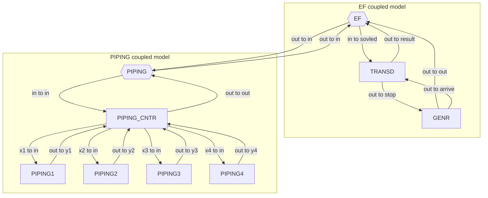

```mermaid
flowchart TB
    subgraph EF coupled model
        direction TB
        EF{{EF}}

        GENR
        TRANSD

        EF -- in to sovled --> TRANSD
        TRANSD --  out to result --> EF
        GENR -- out to out --> EF
        TRANSD -- out to stop --> GENR
        GENR -- out to arrive --> TRANSD
    end

    subgraph PIPING coupled model
        PIPING{{PIPING}}

        PIPING_CNTR
        PIPING1
        PIPING2
        PIPING3
        PIPING4

        PIPING -- in to in --> PIPING_CNTR
        PIPING_CNTR -- out to out --> PIPING

        PIPING_CNTR -- x1 to in --> PIPING1
        PIPING_CNTR -- x2 to in --> PIPING2
        PIPING_CNTR -- x3 to in --> PIPING3
        PIPING_CNTR -- x4 to in --> PIPING4
        
        PIPING1 -- out to y1 --> PIPING_CNTR
        PIPING2 -- out to y2 --> PIPING_CNTR
        PIPING3 -- out to y3 --> PIPING_CNTR
        PIPING4 -- out to y4 --> PIPING_CNTR
    end


    EF -- out to in --> PIPING
    PIPING -- out to in --> EF
    
```