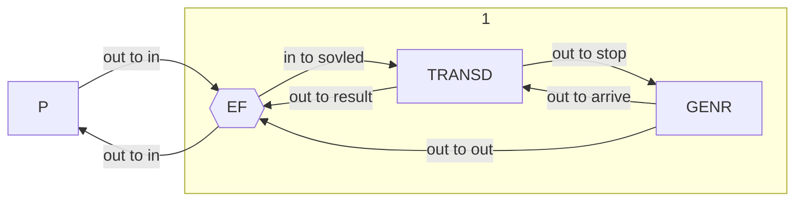

```mermaid
flowchart LR
    P

    subgraph 1
        direction TB
        EF{{EF}}
            
        GENR
        TRANSD

        EF -- in to sovled --> TRANSD
        TRANSD --  out to result --> EF
        GENR -- out to out --> EF
        TRANSD -- out to stop --> GENR
        GENR -- out to arrive --> TRANSD
    end

    EF -- out to in --> P
    P -- out to in --> EF
    
```